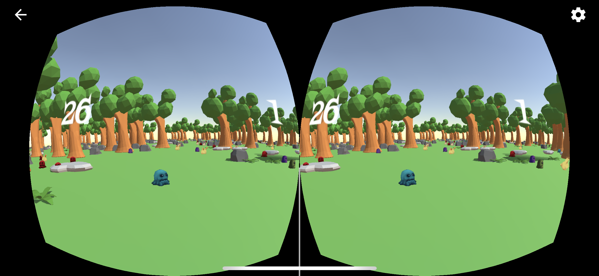
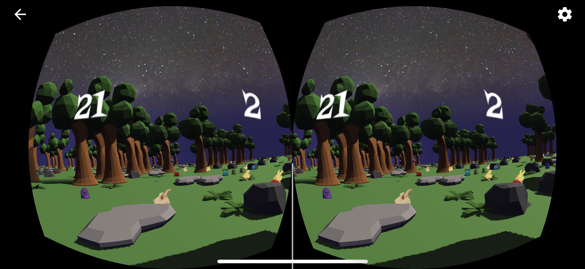
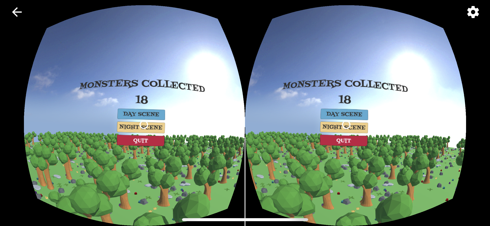

# MonsterGo

A VR game project built with Unity.

## Getting Started

I use [Unity](https://unity3d.com) to build this project.

To keep things as tiny as possible, I didn't include all files in this repo, but you can still build them step by step.

After cloning this repo, open the project with Unity. It'll import some necessary files.

Then navigate to , you can preview the game with different scenes here.

## Dependencies

The setup in my computer:

```
Unity Hub                               Version 0.17.1
Unity                                   Version 2018.1.3f1 Personal
GVR SDK for Unity v1.130.1              GoogleVRForUnity_1.130.1.unitypackage
macOS High Sierra                       Version 10.13.5
Xcode                                   Version 9.3 (9E145)
```

## Build Settings

After cloning this repo, select `File > Build Settings` in the top bar.

Then choose the Platform you want to run and press `Switch Platform`. It'll take some time to import the assets. Here I use `iOS` as example.

Also, make sure that the order of **Scenes In Build** in the `Build Settings` as follows:

```
DataFiles/Scenes/MainScene              0
DataFiles/Scenes/DayScene               1
DataFiles/Scenes/NightScene             2
DataFiles/Scenes/EndScene               3
```

Then click the `Player Settings`.

In `Settings for iOS` -> `Orientation` -> `Default Orientation*`, select `Landscape Left`.

Otherwise, it'll cause unexpected behavior in your iPhone! (I haven't tested the behavior on Android Platform.)

## Running the app

In the top bar, select `Build & Run` and press the `Build And Run` button in the bottom right, then save the project to any name you want.

Unity will then open the Xcode automatically, and make sure to choose the `Team` option (Here I choose Personal Team) in the `Signing` field.

Have fun with the ***MonsterGo***!

## Customization

All script files are in , you can change them on your own.

Other necessary files (Fonts, Prefabs, etc) are in .

## Screenshots

### MainScene


### DayScene



### NightScene



### EndScene


